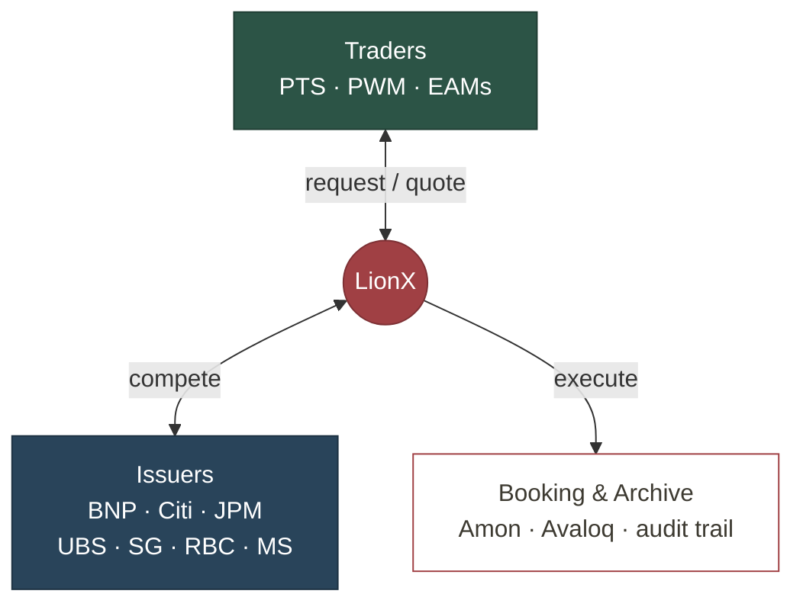

# LionX Migration

Replatforming MNY to a cloud-native foundation on AWS.

<lucide-server class="w-8 h-8" style="color:#29445A"/>
On-prem today

<lucide-arrow-right class="w-8 h-8" style="color:var(--pictet-red)"/>

<lucide-cloud class="w-8 h-8" style="color:var(--pictet-red)"/>
AWS cloud-native

<!--
~10 min. The plan: why we move, where we are, the AWS target, the two phases, the cost and the
governance. Keep it factual, this is for the Cloud committee and stakeholders.
-->

---

# What is LionX

Pictet's trading platform for structured products (internal name: MNY).

<lucide-plug class="w-4 h-4 shrink-0 mt-0.5" style="color: var(--pictet-red)"/>
<b>Connect</b> one protocol to every issuer

<lucide-git-compare class="w-4 h-4 shrink-0 mt-0.5" style="color: var(--pictet-red)"/>
<b>Quote</b> issuers compete, best execution

<lucide-send class="w-4 h-4 shrink-0 mt-0.5" style="color: var(--pictet-red)"/>
<b>Execute</b> routed to internal booking (Amon, Avaloq)

<lucide-archive class="w-4 h-4 shrink-0 mt-0.5" style="color: var(--pictet-red)"/>
<b>Archive</b> every quote and trade, full audit trail

One interface for traders. One integration point for issuers, across PTS, PWM and EAMs.

<!--
LionX gives traders a unified interface instead of one integration per issuer, and gives issuers
a single door into Pictet. Quotes and trades are documented automatically.
-->

---

# Why move to AWS

Our load peaks on market data and sits near zero off-hours and weekends.

<WorkloadChart />

<lucide-cloud class="w-4 h-4 shrink-0 mt-0.5" style="color: var(--pictet-red)"/>
<b>Cloud-native</b> AWS flexibility, autoscaling on peaks

<lucide-sliders-horizontal class="w-4 h-4 shrink-0 mt-0.5" style="color: var(--pictet-red)"/>
<b>Full control</b> over development, operations and infrastructure

<lucide-trending-up class="w-4 h-4 shrink-0 mt-0.5" style="color: var(--pictet-red)"/>
<b>Scalable &amp; auditable</b> a foundation built for growth and compliance

<lucide-git-merge class="w-4 h-4 shrink-0 mt-0.5" style="color: var(--pictet-red)"/>
<b>Continuity first</b> replatform as-is, then improve over time

Fixed on-prem capacity sits idle most of the week, yet still falls short at peaks. AWS scales up on spikes and down to zero when idle.

<!--
The migration is about control and modernization, without breaking what works. Iso-functional
first, cloud-native gains next.
-->

---

# What holds us back today

The on-prem stack works, but it shows its limits.

<lucide-database class="w-6 h-6" style="color:var(--pictet-red)"/>

<b class="text-base">Single-node MongoDB</b> reliability and architecture at risk

<lucide-move-horizontal class="w-6 h-6" style="color:var(--pictet-red)"/>

<b class="text-base">No horizontal scaling</b> several components cannot absorb peaks

<lucide-power class="w-6 h-6" style="color:var(--pictet-red)"/>

<b class="text-base">Stop-the-world deploys</b> PROD is stopped to upgrade, no blue/green

<lucide-wrench class="w-6 h-6" style="color:var(--pictet-red)"/>

<b class="text-base">Complex pipeline</b> pull-based hybrid, Puppet-driven

<!--
These are the concrete pain points the migration addresses. The memory-leak restart and the
single-node MongoDB are the most visible.
-->

---

# Target architecture, step 1: replatform

```mermaid {scale: 0.62}
architecture-beta
  group ext(logos:aws)[External account internet facing]
  group int(logos:aws)[Internal account on prem access]

  service net(internet)[Issuers EAMs] 
  service waf(logos:aws-waf)[WAF ALB] in ext
  service arest(logos:aws-fargate)[Issuer adapters] in ext
  service fw(logos:aws-vpc)[VPC inspector HTTPS only]
  service core(logos:aws-fargate)[Core services] in int
  service iad(logos:aws-ecs)[Internal adapters] in int
  service db(logos:mongodb-icon)[MongoDB Atlas] in int
  service dc(server)[Pictet on prem DC]

  net:R --> L:waf
  waf:R --> L:arest
  arest:R --> L:fw
  fw:R --> L:core
  core:R --> L:iad
  core:B --> T:db
  iad:R --> L:dc
```

Not a lift-and-shift: we retire the hybrid setup for managed services (Atlas, ALB) and a single deployment model.

Issuers and EAMs enter through the external account. PTS and PWM traders reach the core from on-prem, over the private link.

Shared across both accounts
<logos-aws-cloudwatch class="w-4 h-4"/>CloudWatch
<logos-aws-secrets-manager class="w-4 h-4"/>Secrets Manager
<logos-aws-certificate-manager class="w-4 h-4"/>ACM PCA
<logos-aws-s3 class="w-4 h-4"/>S3 snapshots

<!--
Step 1 is a replatform, not a lift-and-shift. Today's hybrid is retired: the dedicated MongoDB and
HAProxy servers (push-based Puppet) plus the pull-based GitOps on Kubernetes give way to managed
MongoDB Atlas, AWS ALB, and one deployment model. External account holds the internet ingress and
issuer adapters; internal account holds the core, internal adapters and Atlas, reaching on-prem via
DX/VPN. VPC inspector between, HTTPS only.
-->

---

# Target architecture, step 2: cloud-native

After the refactor: Lambda adapters behind an API gateway, a simplified scalable core, no in-memory grid.

<lucide-globe class="w-7 h-7" style="color:#6b6b6b"/>Internetissuers, EAMs

<lucide-arrow-right class="w-5 h-5 opacity-40 shrink-0"/>

<logos-aws class="w-3.5 h-3.5"/>EXTERNAL ACCOUNT

<logos-aws-api-gateway class="w-6 h-6"/>API Gateway + WAF

<logos-aws-lambda class="w-5 h-5"/><logos-aws-lambda class="w-5 h-5"/><logos-aws-lambda class="w-5 h-5"/>
Issuer adapters

<logos-aws-vpc class="w-6 h-6"/>VPC inspector

<logos-aws class="w-3.5 h-3.5"/>INTERNAL ACCOUNT

<logos-aws-fargate class="w-6 h-6"/>Scalable core

<logos-aws-eventbridge class="w-6 h-6"/>EventBridge

<logos-aws-lambda class="w-5 h-5"/><logos-aws-lambda class="w-5 h-5"/>
Internal adapters

<logos-aws-documentdb class="w-6 h-6"/>DocumentDB

<lucide-arrow-right class="w-5 h-5 opacity-40"/>DX/VPN

<lucide-building-2 class="w-7 h-7" style="color:#6b6b6b"/>On-premPTS, PWM, data

Issuers and EAMs hit the API gateway; PTS and PWM traders reach the core from on-prem. Adapters run as Lambdas, the core scales horizontally, and the in-memory grid is gone.

Shared across both accounts
<logos-aws-eventbridge class="w-4 h-4"/>EventBridge
<logos-aws-cloudwatch class="w-4 h-4"/>CloudWatch
<logos-aws-secrets-manager class="w-4 h-4"/>Secrets Manager
<logos-aws-s3 class="w-4 h-4"/>S3

<!--
After the cloud-native refactor: issuer and internal adapters run as Lambdas behind API Gateway,
the core is stateless and scales horizontally on Fargate, state lives in Amazon DocumentDB, and the
in-memory grid is removed. Function workloads move to FaaS, event-driven through EventBridge.
-->

---

# A two-phase migration

Business continuity first, cloud-native gains next.

Phase 1: Replatform

<lucide-copy class="w-5 h-5" style="color:var(--pictet-red)"/>

<b>Iso-functional, simpler stack</b> same app behavior; managed services replace the hybrid setup

<lucide-scale class="w-5 h-5" style="color:var(--pictet-red)"/>

<b>Parity</b> performance, security, resilience and audit at least equivalent

<lucide-workflow class="w-5 h-5" style="color:var(--pictet-red)"/>

<b>Modern operations</b> single push-based CI/CD, IaC, blue/green deploys

Phase 2: Leverage the cloud

<lucide-trending-up class="w-5 h-5" style="color:var(--pictet-red)"/>

<b>Elasticity</b> autoscaling on demand; scale down to 20% on nights and weekends

<lucide-heart-pulse class="w-5 h-5" style="color:var(--pictet-red)"/>

<b>High availability</b> multi-AZ, self-healing, automated DR and failover tests

<lucide-zap class="w-5 h-5" style="color:var(--pictet-red)"/>

<b>Serverless and cloud-native</b> FaaS adapters on Lambda, DocumentDB, no in-memory grid

<!--
Phase 1 de-risks the cutover: same app, new ground. Phase 2 is where the cloud pays off,
once the Pictet AWS platform services are available.
-->

---

# Roadmap

Migrate first to reach parity, then modernize. Phased from 2026 to 2028.

Migrate

Preparation and POC

Replatforming on INTG

Cutover INTG

Roll out all envs to PROD

Migration complete

Make LionX cloud native

Horizontally scalable compute

Function workloads to FaaS

Replace in-memory data grid

Run and optimize

We are here

2026
2027
2028
2029

Production on AWS by mid 2027, fully cloud-native by end 2028.

<!--
The first four phases get every environment to AWS and decommission on-prem. The modernization
phases overlap and continue after PROD: observability and security, then exiting GigaSpaces.
-->

---

# Risks we are managing

Known upfront, with mitigation.

<lucide-share-2 class="w-6 h-6" style="color:var(--pictet-red)"/>

<b class="text-base">Shared Pictet services</b> their maturity paces us; possible temporary dual monitoring

<lucide-waypoints class="w-6 h-6" style="color:var(--pictet-red)"/>

<b class="text-base">Network complexity</b> on-prem links, issuer connectivity, firewall inspection

<lucide-triangle-alert class="w-6 h-6" style="color:var(--pictet-red)"/>

<b class="text-base">Replatforming surprises</b> different IO, network and timeout behavior in the cloud

<lucide-heart-pulse class="w-6 h-6" style="color:var(--pictet-red)"/>

<b class="text-base">Service continuity</b> adapting operations and on-call during ramp-up

Each risk has an owner and a mitigation tracked in the migration plan.

<!--
The biggest external dependency is the maturity of shared Pictet platform services. Ownership of
infra scanning and intrusion detection is still to be confirmed with the cyber-security team.
-->

---

# Migration effort

One-time effort to replatform onto AWS, CI/CD from Bamboo to GitHub included. Phase 1 only, not the cloud-native refactor.

AWS landing zone and network

<b>55</b> MD

CI/CD, Bamboo to GitHub Actions

<b>30</b> MD

App replatform on ECS/Fargate

<b>55</b> MD

Data migration, managed services

<b>40</b> MD

Testing, cutover and rollout

<b>75</b> MD

Project management

<b>45</b> MD

estimate
20% margin

~360

man-days (300 + 20% margin)

~1.6

FTE-year

<!--
One-time build cost for the replatform, CI/CD migration included. Excludes the cloud-native
refactor (Phase 2). Man-days are a bottom-up estimate; the day rate is a placeholder to adjust.
-->

---

# Cost, milestone and governance

Zurich list prices, 5 environments at 8 vCPU / 32 GB. Atlas is billed per node; DocumentDB non-prod pauses on weekends.

<CostPie />

Figures are firm through 2027. For the cloud-native years (2028+), budget a ~25% contingency, so plan ~$157k for the optimized target.

<lucide-users class="w-3.5 h-3.5" style="color:var(--pictet-red)"/>Run ~1.5 FTE/year
<lucide-flag class="w-3.5 h-3.5" style="color:var(--pictet-red)"/>Integration env on AWS, end 2026
<lucide-users-round class="w-3.5 h-3.5" style="color:var(--pictet-red)"/>Cloud committee

<!--
Run cost is operations only. Infra is provisional and pre-PoC. The decisive milestone is the
integration environment on AWS at the end of 2026, inside a real pipeline.
-->

---

# Next steps

What we are asking for today.

<lucide-circle-check class="w-6 h-6" style="color:var(--pictet-red)"/>

<b class="text-base">Green-light the plan</b> approve the two-phase migration and its budget envelope

<lucide-file-check class="w-6 h-6" style="color:var(--pictet-red)"/>

<b class="text-base">Chain the ADRs</b> record the architecture decisions back to back to validate and start fast

<lucide-flag class="w-6 h-6" style="color:var(--pictet-red)"/>

<b class="text-base">Integration env by end 2026</b> running on AWS inside a real deployment pipeline

Questions and discussion welcome

