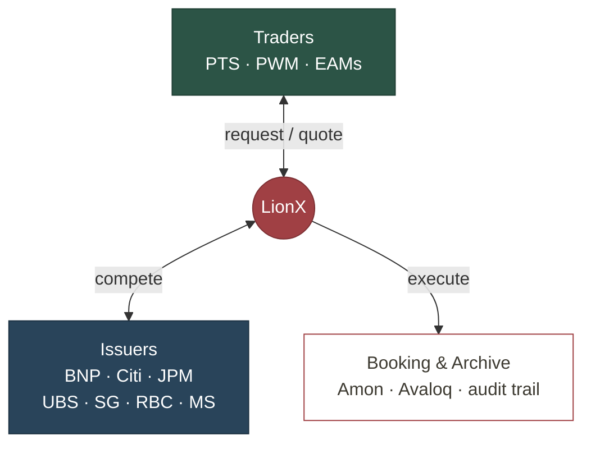

# LionX Migration

Replatforming MNY to a cloud-native foundation on AWS.

<lucide-server class="w-8 h-8" style="color:#29445A"/>
On-prem today

<lucide-arrow-right class="w-8 h-8" style="color:var(--pictet-red)"/>

<lucide-cloud class="w-8 h-8" style="color:var(--pictet-red)"/>
AWS cloud-native

<!--
~10 min. The plan: why we move, where we are, the AWS target, the two phases, the cost and the
governance. Keep it factual, this is for the Cloud committee and stakeholders.
-->

---

# What is LionX

Pictet's trading platform for structured products (internal name: MNY).

<lucide-plug class="w-4 h-4 shrink-0 mt-0.5" style="color: var(--pictet-red)"/>
<b>Connect</b> one protocol to every issuer

<lucide-git-compare class="w-4 h-4 shrink-0 mt-0.5" style="color: var(--pictet-red)"/>
<b>Quote</b> issuers compete, best execution

<lucide-send class="w-4 h-4 shrink-0 mt-0.5" style="color: var(--pictet-red)"/>
<b>Execute</b> routed to internal booking (Amon, Avaloq)

<lucide-archive class="w-4 h-4 shrink-0 mt-0.5" style="color: var(--pictet-red)"/>
<b>Archive</b> every quote and trade, full audit trail

One interface for traders. One integration point for issuers, across PTS, PWM and EAMs.

<!--
LionX gives traders a unified interface instead of one integration per issuer, and gives issuers
a single door into Pictet. Quotes and trades are documented automatically.
-->

---

# Why move to AWS

Our load peaks on market data and sits near zero off-hours and weekends.

<WorkloadChart />

<lucide-compass class="w-4 h-4 shrink-0 mt-0.5" style="color: var(--pictet-red)"/>
<b>Pictet's cloud strategy</b> LionX aligns with the group's move to AWS

<lucide-minimize-2 class="w-4 h-4 shrink-0 mt-0.5" style="color: var(--pictet-red)"/>
<b>Simplify</b> on-prem infra back to industry standards

<lucide-cloud class="w-4 h-4 shrink-0 mt-0.5" style="color: var(--pictet-red)"/>
<b>Cloud-native</b> AWS flexibility, autoscaling on peaks

<lucide-sliders-horizontal class="w-4 h-4 shrink-0 mt-0.5" style="color: var(--pictet-red)"/>
<b>Full control</b> over development, operations and infrastructure

Fixed on-prem capacity sits idle most of the week, yet still falls short at peaks. AWS scales up on spikes and down to zero when idle.

<!--
The migration is about control and modernization, without breaking what works. Iso-functional
first, cloud-native gains next.

Strategie migrations pictet
-->

---

# Today's infrastructure limits

The on-prem stack works, but it shows its limits. AWS addresses each one.

<lucide-database class="w-6 h-6" style="color:var(--pictet-red)"/>

<b class="text-base">Single-node MongoDB</b> reliability and architecture at risk
<lucide-check class="w-3.5 h-3.5 shrink-0"/>Managed, Multi-AZ, resilient and elastic

<lucide-move-horizontal class="w-6 h-6" style="color:var(--pictet-red)"/>

<b class="text-base">No horizontal scaling</b> several components cannot absorb peaks
<lucide-check class="w-3.5 h-3.5 shrink-0"/>Elastic, scales with demand, no fixed capacity

<lucide-power class="w-6 h-6" style="color:var(--pictet-red)"/>

<b class="text-base">No zero-downtime deploys</b> PROD is stopped for every upgrade
<lucide-check class="w-3.5 h-3.5 shrink-0"/>Blue/green rollouts, zero downtime

<lucide-wrench class="w-6 h-6" style="color:var(--pictet-red)"/>

<b class="text-base">Pipeline to simplify</b> Puppet / Docker / Kubernetes =&gt; Terraform
<lucide-check class="w-3.5 h-3.5 shrink-0"/>One Terraform IaC, simple CI/CD

<!--
These are the concrete pain points the migration addresses. The memory-leak restart and the
single-node MongoDB are the most visible.

Formulation : Pourquoi on va beneficier du cloud. Tourner ca en mode simplifier
-->

---

# Target architecture, step 1: replatform

Not a lift-and-shift: we retire the hybrid setup for managed services (Atlas, ALB) and a single deployment model.

<lucide-globe class="w-7 h-7" style="color:#6b6b6b"/>Internetissuers, EAMs

<lucide-arrow-right class="w-5 h-5 opacity-40 shrink-0"/>

<logos-aws class="w-3.5 h-3.5"/>EXTERNAL ACCOUNT

<logos-aws-waf class="w-6 h-6"/>WAF + ALB

<logos-aws-fargate class="w-6 h-6"/>Issuer adapters

<logos-aws-vpc class="w-6 h-6"/>VPC inspector, HTTPS only

<logos-aws class="w-3.5 h-3.5"/>INTERNAL ACCOUNT

<logos-aws-fargate class="w-6 h-6"/>Business logic

<lucide-database class="w-6 h-6" style="color:#6b6b6b"/>In-memory grid

<logos-aws-ecs class="w-6 h-6"/>Internal adapters

<logos-mongodb-icon class="w-6 h-6"/>MongoDB Atlas

<lucide-arrow-right class="w-5 h-5 opacity-40"/>DX/VPN

<lucide-building-2 class="w-7 h-7" style="color:#6b6b6b"/>On-premPTS, PWM, data

Issuers and EAMs enter through the external account. PTS and PWM traders reach the business logic from on-prem, over the private link.

<lucide-file-check class="w-3.5 h-3.5"/>Each building block will be validated with an ADR

Shared across both accounts
<logos-aws-cloudwatch class="w-4 h-4"/>CloudWatch
<logos-aws-secrets-manager class="w-4 h-4"/>Secrets Manager
<logos-aws-certificate-manager class="w-4 h-4"/>ACM PCA
<logos-aws-s3 class="w-4 h-4"/>S3 snapshots

<!--
Step 1 is a replatform, not a lift-and-shift. Today's hybrid is retired: the dedicated MongoDB and
HAProxy servers (push-based Puppet) plus the pull-based GitOps on Kubernetes give way to managed
MongoDB Atlas, AWS ALB, and one deployment model. External account holds the internet ingress and
issuer adapters. Internal account holds the core, internal adapters and Atlas, reaching on-prem via
DX/VPN. VPC inspector between, HTTPS only. Atlas keeps the same engine for the cutover, zero
compatibility risk. The in-memory grid and the switch to DocumentDB are phase 2 work.

Sous validation des ADRs en cours.
-->

---

# Target architecture, step 2: cloud-native

Same accounts, same flows, same security model as step 1. The refactor changes six things inside them.

After step 1

After step 2

Ingress

<logos-aws-waf class="w-4 h-4"/>WAF + ALB

<lucide-arrow-right class="w-4 h-4 opacity-40 mx-auto"/>

<logos-aws-api-gateway class="w-4 h-4"/>API Gateway + WAF

throttling and auth at the edge

Adapters

<logos-aws-fargate class="w-4 h-4"/>Containers, always on

<lucide-arrow-right class="w-4 h-4 opacity-40 mx-auto"/>

<logos-aws-lambda class="w-4 h-4"/>Lambda functions

scale to zero, pay per call

Business logic

<logos-aws-fargate class="w-4 h-4"/>Stateful, fixed size

<lucide-arrow-right class="w-4 h-4 opacity-40 mx-auto"/>

<logos-aws-fargate class="w-4 h-4"/>Stateless, elastic

sized to load, not to peak

State

<lucide-database class="w-4 h-4"/>In-memory data grid

<lucide-arrow-right class="w-4 h-4 opacity-40 mx-auto"/>

<logos-aws-documentdb class="w-4 h-4"/>DocumentDB

state survives restarts

Database

<logos-mongodb-icon class="w-4 h-4"/>MongoDB Atlas

<lucide-arrow-right class="w-4 h-4 opacity-40 mx-auto"/>

<logos-aws-documentdb class="w-4 h-4"/>DocumentDB

same API, a fraction of the run cost

Integration

<lucide-arrow-left-right class="w-4 h-4"/>Point-to-point calls

<lucide-arrow-right class="w-4 h-4 opacity-40 mx-auto"/>

<logos-aws-eventbridge class="w-4 h-4"/>EventBridge

decoupled, replayable events

Everything else carries over from step 1: the two accounts, the VPC inspector, DX/VPN to on-prem, observability.

<lucide-file-check class="w-3.5 h-3.5"/>Each change will be validated with an ADR

<!--
After the cloud-native refactor: issuer and internal adapters run as Lambdas behind API Gateway,
the core is stateless and scales horizontally on Fargate, state lives in Amazon DocumentDB, and the
in-memory database is removed. Function workloads move to FaaS, event-driven through EventBridge.
-->

---

# A two-phase migration

Business continuity first, cloud-native gains next.

Phase 1: Replatform

<lucide-copy class="w-5 h-5" style="color:var(--pictet-red)"/>

<b>Iso-functional, simpler stack</b> same app behavior, managed services replace the hybrid setup

<lucide-scale class="w-5 h-5" style="color:var(--pictet-red)"/>

<b>Parity</b> performance, security, resilience and audit at least equivalent

<lucide-workflow class="w-5 h-5" style="color:var(--pictet-red)"/>

<b>Modern operations</b> single push-based CI/CD, IaC, blue/green deploys

Phase 2: Leverage the cloud

<lucide-trending-up class="w-5 h-5" style="color:var(--pictet-red)"/>

<b>Elasticity</b> autoscaling on demand, scale down to 20% on nights and weekends

<lucide-heart-pulse class="w-5 h-5" style="color:var(--pictet-red)"/>

<b>High availability</b> multi-AZ, self-healing, automated DR and failover tests

<lucide-zap class="w-5 h-5" style="color:var(--pictet-red)"/>

<b>Serverless and cloud-native</b> FaaS adapters on Lambda, DocumentDB, no in-memory database

<!--
Phase 1 de-risks the cutover: same app, new ground. Phase 2 is where the cloud pays off,
once the Pictet AWS platform services are available.
-->

---

# Roadmap

An estimated timeline: migrate first to reach parity, then modernize. Phased from 2026 to mid 2029.

Migrate

Preparation and POC

POC OK

Migrate INTG

INTG live

Migrate CTLQ

CTLQ live

Migrate PROD

PROD live

Decommission on-prem

Make LionX cloud native

Elastic compute

Function workloads to FaaS

Replace in-memory database

Run and optimize

We are here

Migration complete

Cloud-native

2026
2027
2028
2029

Phase 1: migrate
Phase 2: cloud-native

First environment live by end 2026, production on AWS by mid 2027.

<!--
The first four phases get every environment to AWS and decommission on-prem. The modernization
phases overlap and continue after PROD: observability and security, then exiting GigaSpaces.

Detailler  INTG / CTLQ / PROD. vAjouter les jalons
-->

---

# Risks we are managing

Known upfront, with mitigation.

<lucide-share-2 class="w-6 h-6" style="color:var(--pictet-red)"/>

<b class="text-base">Shared Pictet services</b> their maturity paces us, possible temporary dual monitoring

<lucide-waypoints class="w-6 h-6" style="color:var(--pictet-red)"/>

<b class="text-base">Network complexity</b> on-prem links, issuer connectivity, firewall inspection

<lucide-triangle-alert class="w-6 h-6" style="color:var(--pictet-red)"/>

<b class="text-base">Replatforming surprises</b> different IO, network and timeout behavior in the cloud

<lucide-heart-pulse class="w-6 h-6" style="color:var(--pictet-red)"/>

<b class="text-base">Service continuity</b> adapting operations and on-call during ramp-up

Each risk has an owner and a mitigation tracked in the migration plan.

<!--
The biggest external dependency is the maturity of shared Pictet platform services. Ownership of
infra scanning and intrusion detection is still to be confirmed with the cyber-security team.|

Retirer point virguel
-->

---

# Migration effort: Phase 1

Estimated one-time effort to replatform onto AWS, CI/CD from Bamboo to GitHub included.

AWS landing zone and network

<b>55</b> MD

CI/CD, Bamboo to GitHub Actions

<b>30</b> MD

App replatform on ECS/Fargate

<b>55</b> MD

Data migration, managed services

<b>40</b> MD

Testing, cutover and rollout

<b>75</b> MD

Project management

<b>45</b> MD

estimate
20% margin

~360

man-days (300 + 20% margin)

~1.6

FTE-year

<!--
One-time build cost for the replatform, CI/CD migration included. Excludes the cloud-native
refactor (Phase 2). Man-days are a bottom-up estimate; the day rate is a placeholder to adjust.
Migration effort phase 1. 
++ Couts aujourd'hui // Avant et apres pour le TCO ++++ Jour homme dev // pour mettre en evidence RED = Phase 1.
-->

---

# Migration effort: Phase 2

Development effort for the cloud-native refactor. A rougher estimate than Phase 1, higher uncertainty.

Replace the in-memory database

<b>120</b> MD

Stateless, elastic core

<b>80</b> MD

Function workloads to FaaS

<b>70</b> MD

Event-driven and observability

<b>60</b> MD

Testing and hardening

<b>60</b> MD

Project management

<b>40</b> MD

estimate
20% margin

~520

man-days (430 + 20% margin)

~2.3

FTE-year

<!--
Phase 2 = cloud-native refactor. Development estimate, higher uncertainty than Phase 1. The
in-memory database removal is the main driver. Bottom-up, to be refined with the team.
-->

---

# The cost curve

An estimate of the run cost, in CHF per year, from Zurich list prices, plus 25% contingency.

<svg viewBox="0 0 760 235" width="760" height="235" style="position:absolute;inset:0">
<defs>
<linearGradient id="phase1" x1="0" y1="0" x2="0" y2="1"><stop offset="0%" stop-color="#A04044" stop-opacity="0.16"/><stop offset="100%" stop-color="#A04044" stop-opacity="0"/></linearGradient>
<linearGradient id="phase2" x1="0" y1="0" x2="0" y2="1"><stop offset="0%" stop-color="#29445A" stop-opacity="0.16"/><stop offset="100%" stop-color="#29445A" stop-opacity="0"/></linearGradient>
</defs>
<path d="M120,62 L400,71 L400,180 L120,180 Z" fill="url(#phase1)"/>
<path d="M400,71 L660,88 L660,180 L400,180 Z" fill="url(#phase2)"/>
<line x1="120" y1="180" x2="660" y2="180" stroke="#e3e3e3" stroke-width="1"/>
<line x1="120" y1="62" x2="672" y2="62" stroke="#cfcfcf" stroke-width="1" stroke-dasharray="3 4"/>
<path d="M120,135 L400,144" fill="none" stroke="#A04044" stroke-width="2" stroke-dasharray="6 5" stroke-linecap="round" stroke-opacity="0.75"/>
<path d="M400,144 L660,152" fill="none" stroke="#29445A" stroke-width="2" stroke-dasharray="6 5" stroke-linecap="round" stroke-opacity="0.75"/>
<circle cx="120" cy="135" r="3" fill="#A04044"/><circle cx="400" cy="144" r="3" fill="#A04044"/><circle cx="660" cy="152" r="3" fill="#29445A"/>
<path d="M120,62 L400,71" fill="none" stroke="#A04044" stroke-width="4" stroke-linecap="round"/>
<path d="M400,71 L660,88" fill="none" stroke="#29445A" stroke-width="4" stroke-linecap="round" stroke-dasharray="10 8"/>
<circle cx="120" cy="62" r="6" fill="#A04044" stroke="#fff" stroke-width="2.5"/>
<circle cx="400" cy="71" r="6" fill="#A04044" stroke="#fff" stroke-width="2.5"/>
<circle cx="660" cy="88" r="8" fill="#29445A" stroke="#fff" stroke-width="2.5"/>
</svg>

650k

~600k

-8%

~505k

-22%

Team

400k

~350k

Infra

250k

~200k

~155k

On-prem

today

Replatform

Phase 1, iso-functional

Cloud-native

Phase 2, optimised

<!--
Run cost is operations only. Infra is provisional and pre-PoC. The decisive milestone is the
integration environment on AWS at the end of 2026, inside a real pipeline.

Ca ressemble trop a un avant apres.
Ajouter une marge. Replatforming, entre 180-200. Actuel vs futur
-->

---

# Next steps

What we are asking for today.

<lucide-circle-check class="w-6 h-6" style="color:var(--pictet-red)"/>

<b class="text-base">Green-light the plan</b> approve the two-phase migration and its budget envelope

<lucide-file-check class="w-6 h-6" style="color:var(--pictet-red)"/>

<b class="text-base">Chain the ADRs</b> record the architecture decisions back to back to validate and start fast

<lucide-flag class="w-6 h-6" style="color:var(--pictet-red)"/>

<b class="text-base">Integration env by end 2026</b> running on AWS inside a real deployment pipeline

Questions and discussion welcome

<!--
Manquant:

Partie dev (Migration chiffrage),
TCO actuel,
Revoir les marges, ne pas que ca ressemble a un avant apres.
Ajouter les jalons projet. Ajouter "sous validation des ADRs" dans la slide archi
-->
