```mermaid {scale: 0.4}
architecture-beta
  group aws(logos:aws)[ ]
  service waf(logos:aws-waf)[WAF] in aws
  service alb(logos:aws-elb)[ALB] in aws
  service ecs(logos:aws-ecs)[ECS] in aws
  service db(logos:aws-rds)[RDS] in aws
  service sm(logos:aws-secrets-manager)[Secrets] in aws
  service log(logos:aws-cloudwatch)[Logs] in aws
  waf:R --> L:alb
  alb:R --> L:ecs
  ecs:R --> L:db
  sm:B --> T:ecs
  ecs:B --> T:log
```

# Les ADR

<div class="opacity-70 mt-2">Documenter nos décisions d'architecture, et surtout leur pourquoi.</div>

<!--
~10 min. D'abord le concept : la douleur (tkt c'est historique), ce qu'est une ADR, MADR, les
règles d'or. Ensuite notre template en live : le site, les diagrammes, Claude. Avoir le site
ADR déployé ouvert dans un onglet.
-->

---

# Problématique

<div class="text-sm opacity-70 -mt-1">Une décision prise, jamais écrite.</div>

<div class="flex flex-col items-center mt-7">

<div class="flex flex-col gap-2 w-full max-w-lg">
<div class="self-start max-w-[80%] bg-gray-100 rounded-2xl rounded-bl-sm px-4 py-2.5 text-base shadow-sm"><b style="color: var(--pictet-red)">Rui :</b> <span class="opacity-80">pourquoi Postgres et pas Mongo ?</span></div>
<div class="self-end max-w-[80%] text-white rounded-2xl rounded-br-sm px-4 py-2.5 text-base shadow-sm" style="background:#29445A"><b>Bayar :</b> tkt, c'est historique</div>
</div>

<div class="mt-9 text-xs uppercase tracking-widest opacity-50">Six mois plus tard</div>

<div class="mt-4 flex justify-center gap-4">
<div class="w-44 px-4 py-4 rounded-xl bg-white border border-gray-200 shadow-sm text-center">
<div class="w-9 h-9 mx-auto rounded-lg flex items-center justify-center mb-2" style="background:#f3e0e0"><lucide-user-x class="w-4.5 h-4.5" style="color: var(--pictet-red)"/></div>
<div class="font-bold">Qui ?</div>
<div class="text-xs opacity-50 mt-0.5">aucun nom</div>
</div>
<div class="w-44 px-4 py-4 rounded-xl bg-white border border-gray-200 shadow-sm text-center">
<div class="w-9 h-9 mx-auto rounded-lg flex items-center justify-center mb-2" style="background:#f3e0e0"><lucide-calendar-x class="w-4.5 h-4.5" style="color: var(--pictet-red)"/></div>
<div class="font-bold">Quand ?</div>
<div class="text-xs opacity-50 mt-0.5">aucune date</div>
</div>
<div class="w-44 px-4 py-4 rounded-xl bg-white border border-gray-200 shadow-sm text-center">
<div class="w-9 h-9 mx-auto rounded-lg flex items-center justify-center mb-2" style="background:#f3e0e0"><lucide-circle-help class="w-4.5 h-4.5" style="color: var(--pictet-red)"/></div>
<div class="font-bold">Pourquoi ?</div>
<div class="text-xs opacity-50 mt-0.5">aucune trace</div>
</div>
</div>

<div class="mt-6 text-sm opacity-55">On re-débat des choix déjà tranchés.</div>

</div>

<!--
LA slide clé pour un public novice : la douleur d'abord. On lit la blague, on laisse respirer,
on enfonce le clou (on re-débat, on refait les erreurs). L'ADR devient évidente juste après.
-->

---

# Une ADR, c'est quoi ?

<div class="mt-4 text-center text-2xl font-semibold leading-snug max-w-3xl mx-auto">Un texte qui acte une décision d'archi,<br/>et surtout son <span style="color: var(--pictet-red)">pourquoi</span>.</div>

<div class="flex items-stretch justify-center gap-2 mt-9 text-left">

<div class="flex-1 max-w-[15rem] px-4 py-5 rounded-xl bg-white border border-gray-200 shadow-sm">
<div class="w-10 h-10 rounded-lg flex items-center justify-center mb-3" style="background:#f3e0e0"><lucide-target class="w-5 h-5" style="color: var(--pictet-red)"/></div>
<div class="font-bold">Le contexte</div>
<div class="text-sm opacity-55 mt-1">le problème et les contraintes</div>
</div>

<div class="flex items-center"><lucide-chevron-right class="w-6 h-6 opacity-25"/></div>

<div class="flex-1 max-w-[15rem] px-4 py-5 rounded-xl bg-white border border-gray-200 shadow-sm">
<div class="w-10 h-10 rounded-lg flex items-center justify-center mb-3" style="background:#f3e0e0"><lucide-git-branch class="w-5 h-5" style="color: var(--pictet-red)"/></div>
<div class="font-bold">Les options</div>
<div class="text-sm opacity-55 mt-1">ce qu'on a comparé</div>
</div>

<div class="flex items-center"><lucide-chevron-right class="w-6 h-6 opacity-25"/></div>

<div class="flex-1 max-w-[15rem] px-4 py-5 rounded-xl border-2 shadow-md" style="border-color: var(--pictet-red); background:#fbf3f3">
<div class="w-10 h-10 rounded-lg flex items-center justify-center mb-3" style="background: var(--pictet-red)"><lucide-circle-check class="w-5 h-5 text-white"/></div>
<div class="font-bold">La décision et le pourquoi</div>
<div class="text-sm opacity-60 mt-1">la raison, écrite noir sur blanc</div>
<div class="text-[0.6rem] uppercase tracking-widest font-bold mt-2" style="color: var(--pictet-red)">le cœur de l'ADR</div>
</div>

</div>

<div class="mt-8 flex flex-wrap items-center justify-center gap-x-6 gap-y-2 text-sm">
<span class="flex items-center gap-1.5 opacity-70"><lucide-anchor class="w-4 h-4" style="color: var(--pictet-red)"/>le pourquoi reste</span>
<span class="flex items-center gap-1.5 opacity-70"><lucide-users class="w-4 h-4" style="color: var(--pictet-red)"/>alignement d'équipe</span>
<span class="flex items-center gap-1.5 opacity-70"><lucide-shield-check class="w-4 h-4" style="color: var(--pictet-red)"/>décidé à plusieurs</span>
<span class="flex items-center gap-1.5 opacity-70"><lucide-rocket class="w-4 h-4" style="color: var(--pictet-red)"/>onboarding rapide</span>
<span class="flex items-center gap-1.5 opacity-70"><lucide-check-check class="w-4 h-4" style="color: var(--pictet-red)"/>on ne re-débat plus</span>
</div>

<!--
La définition, martelée : "un petit fichier qui acte une décision et surtout son pourquoi".
C'est LE truc à retenir. Le flux montre ce qu'il y a dedans, la ligne du bas les bénéfices.
-->

---

# MADR

<div class="text-sm opacity-70 -mt-1"><b>Markdown Architectural Decision Records</b> : le format standard pour documenter une décision.</div>

<div class="grid grid-cols-[5fr_7fr] gap-3 mt-1 text-left text-sm items-stretch">

<div class="rounded-xl border border-gray-200 bg-gray-50/60 p-2">
<div class="flex items-center gap-2 mb-1"><lucide-tag class="w-4 h-4 opacity-45"/><span class="text-xs uppercase tracking-widest opacity-55 font-semibold">En-tête</span><span class="text-[0.6rem] opacity-40 ml-auto">métadonnées</span></div>
<div class="flex flex-col gap-1">
<div class="px-3 py-0.5 rounded-lg bg-white border border-gray-200 shadow-sm"><b>Status</b><br/><span class="text-[0.72rem] opacity-60 italic leading-tight">accepted</span></div>
<div class="px-3 py-0.5 rounded-lg bg-white border border-gray-200 shadow-sm"><b>Date</b><br/><span class="text-[0.72rem] opacity-60 italic leading-tight">2026-05-07</span></div>
<div class="px-3 py-0.5 rounded-lg bg-white border border-gray-200 shadow-sm"><b>Deciders</b><br/><span class="text-[0.72rem] opacity-60 italic leading-tight">Thibaud</span></div>
</div>
</div>

<div class="rounded-xl border-2 p-2 shadow-md" style="border-color: var(--pictet-red); background:#fbf3f3">
<div class="flex items-center gap-2 mb-1" style="color: var(--pictet-red)"><lucide-asterisk class="w-4 h-4"/><span class="text-xs uppercase tracking-widest font-bold">Obligatoire</span><span class="text-[0.6rem] opacity-70 ml-auto">le noyau</span></div>
<div class="flex flex-col gap-1">
<div class="px-3 py-0.5 rounded-lg bg-white border border-gray-200 shadow-sm flex gap-2.5 items-start"><span class="w-5 h-5 rounded-full text-white text-xs font-bold flex items-center justify-center shrink-0 mt-0.5" style="background: var(--pictet-red)">1</span><div><b>Context and problem statement</b><br/><span class="text-[0.72rem] opacity-60 italic leading-tight">Stocker les données d'un nouveau service transactionnel.</span></div></div>
<div class="px-3 py-0.5 rounded-lg bg-white border border-gray-200 shadow-sm flex gap-2.5 items-start"><span class="w-5 h-5 rounded-full text-white text-xs font-bold flex items-center justify-center shrink-0 mt-0.5" style="background: var(--pictet-red)">2</span><div><b>Considered options</b><br/><span class="text-[0.72rem] opacity-60 italic leading-tight">PostgreSQL, MongoDB, DynamoDB.</span></div></div>
<div class="px-3 py-0.5 rounded-lg bg-white border border-gray-200 shadow-sm flex gap-2.5 items-start"><span class="w-5 h-5 rounded-full text-white text-xs font-bold flex items-center justify-center shrink-0 mt-0.5" style="background: var(--pictet-red)">3</span><div><b>Decision outcome</b><br/><span class="text-[0.72rem] opacity-60 italic leading-tight">PostgreSQL : transactions ACID, requêtes riches.</span></div></div>
</div>
</div>

</div>

<div class="mt-1 rounded-xl border border-gray-200 bg-gray-50/60 p-2 text-left">
<div class="flex items-center gap-2 mb-1"><lucide-plus class="w-4 h-4 opacity-45"/><span class="text-xs uppercase tracking-widest opacity-55 font-semibold">Optionnel</span><span class="text-[0.6rem] opacity-40 ml-auto">selon le besoin</span></div>
<div class="flex flex-col gap-0.5 text-sm">
<div class="px-3 py-0.5 rounded-lg bg-white border border-gray-200 shadow-sm flex items-center gap-3"><b class="w-40 shrink-0">Decision drivers</b><span class="flex-1 min-w-0 text-[0.72rem] opacity-60 italic leading-tight">intégrité des données, requêtage, compétences</span><span class="text-[0.55rem] uppercase tracking-wide font-semibold shrink-0 px-1.5 py-0.5 rounded" style="color: var(--pictet-red); background:#f3e0e0">conseillé</span></div>
<div class="px-3 py-0.5 rounded-lg bg-white border border-gray-200 shadow-sm flex items-center gap-3"><b class="w-40 shrink-0">Consequences</b><span class="flex-1 min-w-0 text-[0.72rem] opacity-60 italic leading-tight">garanties ACID fortes, mais schéma moins souple</span><span class="text-[0.55rem] uppercase tracking-wide font-semibold shrink-0 px-1.5 py-0.5 rounded" style="color: var(--pictet-red); background:#f3e0e0">conseillé</span></div>
<div class="px-3 py-0.5 rounded-lg bg-white border border-gray-200 shadow-sm flex items-center gap-3"><b class="w-40 shrink-0">Pros and cons</b><span class="flex-1 min-w-0 text-[0.72rem] opacity-60 italic leading-tight">MongoDB : flexible mais transactions limitées</span><span class="text-[0.55rem] uppercase tracking-wide font-semibold shrink-0 px-1.5 py-0.5 rounded" style="color: var(--pictet-red); background:#f3e0e0">conseillé</span></div>
<div class="px-3 py-0.5 rounded-lg bg-white border border-gray-200 shadow-sm flex items-center gap-3"><b class="w-40 shrink-0">Confirmation</b><span class="flex-1 min-w-0 text-[0.72rem] opacity-60 italic leading-tight">revue d'archi passée, migrations prêtes</span></div>
<div class="px-3 py-0.5 rounded-lg bg-white border border-gray-200 shadow-sm flex items-center gap-3"><b class="w-40 shrink-0">More information</b><span class="flex-1 min-w-0 text-[0.72rem] opacity-60 italic leading-tight">voir ADR-0002 sur le cache</span></div>
</div>
</div>

<!--
Présente MADR proprement : à gauche le noyau requis en cartes rouges (trois sections, c'est le
minimum pour une décision), à droite les optionnelles qu'on remplit selon le besoin, avec
quand chacune sert. La template garde tout, rien n'est retiré.
-->

---

# MADR, en exemple

<div class="text-sm opacity-70 -mt-1">La même template, remplie pour une vraie décision.</div>

<div class="mx-auto mt-5 max-w-3xl text-left bg-white border border-gray-200 rounded-2xl shadow-lg overflow-hidden">

<div class="flex items-center justify-between px-5 py-3 border-b border-gray-100 bg-gray-50/60">
<div class="flex items-center gap-3">
<span class="text-[0.6rem] uppercase tracking-widest font-bold px-2 py-1 rounded" style="background:#e7f0ea;color:#2C5446">accepted</span>
<b class="text-base">ADR-0001 : PostgreSQL over MongoDB</b>
</div>
<span class="text-xs opacity-50">2026-05-07 · Thibaud</span>
</div>

<div class="px-5 py-4 flex flex-col gap-3 text-sm">

<div class="border-l-4 pl-3" style="border-left-color: var(--pictet-red)">
<div class="flex items-center gap-1.5 text-[0.65rem] uppercase tracking-widest font-semibold opacity-55 mb-0.5"><lucide-target class="w-3 h-3"/>Context and problem statement</div>
<div>Stocker les données d'un nouveau service transactionnel, avec des garanties fortes.</div>
</div>

<div class="border-l-4 pl-3" style="border-left-color: var(--pictet-red)">
<div class="flex items-center gap-1.5 text-[0.65rem] uppercase tracking-widest font-semibold opacity-55 mb-1"><lucide-git-branch class="w-3 h-3"/>Pros and cons of the options</div>
<div class="flex flex-col gap-1">
<div class="flex items-baseline gap-2"><b class="w-24 shrink-0">PostgreSQL</b><span class="text-xs"><span style="color:#2C7a4d">+ ACID, requêtes riches</span> <span class="opacity-30">·</span> <span style="color: var(--pictet-red)">− schéma rigide</span></span></div>
<div class="flex items-baseline gap-2"><b class="w-24 shrink-0">MongoDB</b><span class="text-xs"><span style="color:#2C7a4d">+ schéma flexible</span> <span class="opacity-30">·</span> <span style="color: var(--pictet-red)">− transactions limitées</span></span></div>
<div class="flex items-baseline gap-2"><b class="w-24 shrink-0">DynamoDB</b><span class="text-xs"><span style="color:#2C7a4d">+ managé, scale auto</span> <span class="opacity-30">·</span> <span style="color: var(--pictet-red)">− requêtes limitées, lock-in</span></span></div>
</div>
</div>

<div class="border-l-4 pl-3 py-2 rounded-r-md" style="border-left-color: var(--pictet-red); background:#faf4f4">
<div class="flex items-center gap-1.5 text-[0.65rem] uppercase tracking-widest font-semibold mb-0.5" style="color: var(--pictet-red)"><lucide-circle-check class="w-3 h-3"/>Decision outcome</div>
<div><b>PostgreSQL.</b> Transactions ACID, requêtes riches, et l'équipe est déjà à l'aise. MongoDB séduisant mais nos données sont très relationnelles.</div>
</div>

</div>
</div>

<div class="mt-3 text-center text-sm opacity-60">On relit la décision <b>et</b> le pourquoi, six mois ou trois ans plus tard.</div>

<!--
L'exemple concret qui rend MADR tangible : la template précédente, remplie. On retrouve le
contexte, le pour/contre de chaque option (section MADR "Pros and Cons of the Options"), et la
décision motivée. C'est exactement l'ADR-0001 qu'on montre ensuite rendue en page de site.
-->

---

# Les règles d'or

<div class="text-sm opacity-70 -mt-1">Cinq réflexes pour que vos ADR restent utiles.</div>

<div class="mx-auto max-w-2xl mt-7 flex flex-col gap-3 text-left">

<div class="flex items-start gap-3">
<span class="w-6 h-6 rounded-full text-white text-sm font-bold flex items-center justify-center shrink-0" style="background: var(--pictet-red)">1</span>
<div><b>Pas d'ADR tout seul.</b> <span class="opacity-60">Décidée et relue à plusieurs, jamais dans son coin.</span></div>
</div>

<div class="flex items-start gap-3">
<span class="w-6 h-6 rounded-full text-white text-sm font-bold flex items-center justify-center shrink-0" style="background: var(--pictet-red)">2</span>
<div><b>On ne change pas une ADR acceptée.</b> <span class="opacity-60">On en écrit une nouvelle.</span></div>
</div>

<div class="flex items-start gap-3">
<span class="w-6 h-6 rounded-full text-white text-sm font-bold flex items-center justify-center shrink-0" style="background: var(--pictet-red)">3</span>
<div><b>Une décision par ADR.</b> <span class="opacity-60">Atomique, jamais un fourre-tout.</span></div>
</div>

<div class="flex items-start gap-3">
<span class="w-6 h-6 rounded-full text-white text-sm font-bold flex items-center justify-center shrink-0" style="background: var(--pictet-red)">4</span>
<div><b>Le pourquoi avant le quoi.</b> <span class="opacity-60">La raison et les options écartées.</span></div>
</div>

<div class="flex items-start gap-3">
<span class="w-6 h-6 rounded-full text-white text-sm font-bold flex items-center justify-center shrink-0" style="background: var(--pictet-red)">5</span>
<div><b>Écrire à chaud.</b> <span class="opacity-60">Au moment de décider, tant que le contexte est frais.</span></div>
</div>

</div>

<div class="mt-7 mx-auto max-w-2xl rounded-xl border-2 px-5 py-3 flex items-center gap-3" style="border-color: var(--pictet-red); background:#fbf3f3">
<lucide-triangle-alert class="w-6 h-6 shrink-0" style="color: var(--pictet-red)"/>
<div class="text-left"><b>On n'ADR-ise pas la stack existante.</b><br/><span class="opacity-70">Une ADR, c'est une nouvelle décision, à partir de maintenant.</span></div>
</div>

<!--
Les bonnes pratiques. La n°1 (immuable) est la plus importante : on ne réécrit pas l'histoire, on
remplace. Et le piège classique : vouloir tout ADR-iser rétroactivement. Non, on part de maintenant,
pour les nouvelles décisions.
-->

---

# Du markdown au site

<div class="text-sm opacity-70 -mt-1">Chaque décision est un fichier markdown, rendu en page du site.</div>

<div class="grid grid-cols-2 gap-6 mt-3 items-center">

<div class="text-sm">

```md
---
title: "ADR-0001: ECS over EKS"
sidebar:
  badge: { text: accepted }
---
* Status: accepted
* Date: 2026-05-07
* Deciders: Sofiane, Bayar, Rui, Laurent

## Context and problem statement
## Decision drivers
## Considered options
## Decision outcome
  ### Consequences
  ### Confirmation
```

</div>

<div>
<div class="mx-auto rounded-lg shadow-2xl border border-gray-200 h-[16rem] w-full bg-white" style="background-image: url(/adr-top.png); background-size: contain; background-repeat: no-repeat; background-position: center;"></div>
</div>

</div>

<div class="mt-3 text-center text-sm opacity-60">Vous écrivez le contenu. Navigation, recherche et badges sont générés.</div>

<style>
.slidev-code { font-size: 0.72rem !important; line-height: 1.45 !important; }
</style>

<!--
Le coeur de la template, en live. À gauche le fichier que tu écris (le badge de la sidebar
vient du frontmatter), à droite la page générée. Le format (MADR) est détaillé slide suivante.
Basculer sur le vrai site : sidebar, ouvrir un ADR, scroller. Capture = secours.
-->

---

# Le diagramme d'archi, c'est du texte

<div class="text-sm opacity-70 -mt-1">À gauche ce que vous écrivez dans l'ADR, à droite ce qui s'affiche. Vraies icônes AWS.</div>

<div class="grid grid-cols-[1fr_auto_1fr] gap-4 mt-3 items-center">

<div class="rounded-xl border border-gray-200 shadow-lg overflow-hidden bg-white">
<div class="flex items-center gap-1.5 px-3 py-2 border-b border-gray-100 bg-gray-50">
<span class="w-2.5 h-2.5 rounded-full inline-block" style="background:#ef7676"></span>
<span class="w-2.5 h-2.5 rounded-full inline-block" style="background:#f5c451"></span>
<span class="w-2.5 h-2.5 rounded-full inline-block" style="background:#6bbf6b"></span>
<span class="ml-2 text-xs opacity-45">adr-0004-network.md</span>
</div>

```ruby
architecture-beta
  group aws(logos:aws)[ ]
  service waf(logos:aws-waf)[WAF] in aws
  service alb(logos:aws-elb)[ALB] in aws
  service ecs(logos:aws-ecs)[ECS] in aws
  service db(logos:aws-rds)[RDS] in aws
  service sm(logos:aws-secrets-manager)[Secrets] in aws
  service log(logos:aws-cloudwatch)[Logs] in aws
  waf:R --> L:alb
  alb:R --> L:ecs
  ecs:R --> L:db
  sm:B --> T:ecs
  ecs:B --> T:log
```

</div>

<div class="flex items-center justify-center"><lucide-arrow-right class="w-7 h-7 opacity-25"/></div>

<div class="rounded-xl border border-gray-200 shadow-lg bg-white px-3 py-2 flex items-center justify-center">



</div>

</div>

<div class="mt-3 text-center text-sm opacity-60">Le diagramme <b class="opacity-80">EST</b> le texte de l'ADR. Fini les PNG exportés qui périment.</div>

<div class="mt-3 mx-auto max-w-md flex flex-col gap-1.5">
<div class="self-start max-w-[85%] bg-gray-100 rounded-2xl rounded-bl-sm px-3 py-1.5 text-sm shadow-sm"><b style="color: var(--pictet-red)">Rui :</b> <span class="opacity-80">t'as fait ce diagramme avec quel outil ?</span></div>
<div class="self-end max-w-[85%] text-white rounded-2xl rounded-br-sm px-3 py-1.5 text-sm shadow-sm" style="background:#29445A"><b>Laurent :</b> un clavier</div>
</div>

<style>
.slidev-code { font-size: 0.68rem !important; line-height: 1.5 !important; }
</style>

<!--
La preuve que c'est du texte : même bloc à gauche (source) et à droite (rendu). Quelques lignes
lisibles, des icônes AWS officielles via le pack iconify. Ça vit dans le fichier ADR.
-->

---

# Et Claude l'écrit pour vous

<div class="text-sm opacity-70 -mt-1">Le diagramme et l'ADR sont du texte, donc Claude les écrit et les met à jour pour vous.</div>

<div class="grid grid-cols-2 gap-6 mt-5 items-stretch">

<div class="flex flex-col gap-3 text-sm">
<div class="p-4 rounded-lg bg-gray-50 border border-gray-200">
<div class="text-xs opacity-40 mb-1">Vous</div>
« Ajoutez un cache ElastiCache devant ECS, et notez le compromis coût / latence dans l'ADR. »
</div>
<div class="p-4 rounded-lg bg-gray-50 border border-gray-200">
<div class="text-xs opacity-40 mb-1">Claude</div>
Schéma et décision mis à jour, prêts à relire dans la PR.
</div>
</div>

<div class="text-xs flex items-center">

```diff
  service ecs(logos:aws-ecs)[ECS] in aws
+ service cache(logos:aws-elasticache)[Cache] in aws
- alb:B --> T:ecs
+ alb:B --> T:cache
+ cache:B --> T:ecs

  ## Decision drivers
- * réduire le coût
+ * latence p99 sous 50 ms, coût maîtrisé
```

</div>

</div>

<div class="mt-4 text-center text-sm opacity-60">Une demande met à jour le schéma et la décision d'un coup, et vous validez en PR.</div>

<div class="mt-3 mx-auto max-w-md flex flex-col gap-1.5">
<div class="self-start max-w-[85%] bg-gray-100 rounded-2xl rounded-bl-sm px-3 py-1.5 text-sm shadow-sm"><b style="color: var(--pictet-red)">Rui :</b> <span class="opacity-80">si ça casse, c'est la faute de l'IA</span></div>
<div class="self-end max-w-[85%] text-white rounded-2xl rounded-br-sm px-3 py-1.5 text-sm shadow-sm" style="background:#29445A"><b>Laurent :</b> c'est toi qui as merge</div>
</div>

<style>
.slidev-code { font-size: 0.72rem !important; line-height: 1.5 !important; }
</style>

<!--
L'angle qui parle à un public tech : tout est du texte, donc Claude (Code) écrit et modifie le
markdown et le mermaid directement dans le dépôt. Le contrôle reste humain : on relit le diff
dans la PR. Pas de magie, pas de lock-in.
-->

---

# Côté lecteur

<div class="text-sm opacity-70 -mt-1">Vous écrivez du markdown, le lecteur obtient une vraie doc.</div>

<div class="grid grid-cols-5 gap-6 mt-5 items-center">

<div class="col-span-3">
<div class="rounded-xl bg-white border border-gray-200 shadow-2xl overflow-hidden text-left">
<div class="flex items-center gap-3 px-4 py-3 border-b border-gray-100">
<svg width="18" height="18" viewBox="0 0 24 24" fill="none" stroke="currentColor" stroke-width="2" class="opacity-40"><circle cx="11" cy="11" r="7"/><line x1="21" y1="21" x2="16.65" y2="16.65"/></svg>
<span class="text-base">ECS</span>
<span class="inline-block w-px h-4 bg-gray-700"></span>
<span class="ml-auto text-[0.65rem] opacity-40 border border-gray-300 rounded px-1.5 py-0.5">esc</span>
</div>
<div class="text-sm">
<div class="px-4 py-2 bg-gray-50 border-b border-gray-100"><b>ADR-0001 : <mark style="background:#fde68a">ECS</mark> over EKS</b><div class="text-xs opacity-50">Architecture Decision Records</div></div>
<div class="px-4 py-2 border-b border-gray-100"><b>ADR-0003 : AWS resource tagging</b><div class="text-xs opacity-50">… services <mark style="background:#fde68a">ECS</mark> …</div></div>
<div class="px-4 py-2"><b>ADR-0005 : CloudWatch monitoring</b><div class="text-xs opacity-50">… tâches <mark style="background:#fde68a">ECS</mark> …</div></div>
</div>
</div>
<div class="mt-2 text-center text-xs opacity-50">Recherche plein-texte, sur tout le site.</div>
</div>

<div class="col-span-2 flex flex-col gap-2.5 text-sm">
<div class="px-3 py-2 rounded-lg bg-white border border-gray-200 border-l-4 shadow-sm" style="border-left-color: var(--pictet-red)"><b>Navigation & badges</b><br/><span class="text-xs opacity-55">la liste des ADR, avec leur statut</span></div>
<div class="px-3 py-2 rounded-lg bg-white border border-gray-200 border-l-4 shadow-sm" style="border-left-color: var(--pictet-red)"><b>Sommaire</b><br/><span class="text-xs opacity-55">saut direct dans la page</span></div>
<div class="px-3 py-2 rounded-lg bg-white border border-gray-200 border-l-4 shadow-sm" style="border-left-color: var(--pictet-red)"><b>Mode clair / sombre</b><br/><span class="text-xs opacity-55">priorité n°1, valeur maximale</span></div>
<div class="px-3 py-2 rounded-lg bg-white border border-gray-200 border-l-4 shadow-sm" style="border-left-color: var(--pictet-red)"><b>Responsive</b><br/><span class="text-xs opacity-55">lisible sur mobile</span></div>
</div>

</div>

<div class="mt-4 text-center text-sm opacity-60">Tout est généré à partir du markdown.</div>

<!--
Slide showcase du site généré, côté lecteur. En live : ouvrir la recherche (taper "ECS"),
montrer la sidebar avec les badges de statut, le sommaire, basculer clair/sombre, et que c'est
responsive. Tout vient du markdown, rien n'est codé à la main. Pagefind pour la recherche.
-->

---

# Allons plus loin

<div class="text-sm opacity-70 -mt-1">Ce qu'on peut ajouter ensuite.</div>

<div class="grid grid-cols-2 gap-8 max-w-3xl mx-auto mt-8 text-left text-sm">

<div>
<div class="text-xs uppercase tracking-widest mb-3" style="color: var(--pictet-red)">Gouvernance</div>
<div class="flex flex-col gap-2 opacity-80">
<div class="flex gap-2"><span style="color: var(--pictet-red)">•</span>Review auto des PR d'ADR (Copilot)</div>
<div class="flex gap-2"><span style="color: var(--pictet-red)">•</span>Checks CI de format et conformité</div>
<div class="flex gap-2"><span style="color: var(--pictet-red)">•</span>Validation en PR, sans réunion</div>
</div>
</div>

<div>
<div class="text-xs uppercase tracking-widest mb-3" style="color: var(--pictet-red)">Passage à l'échelle</div>
<div class="flex flex-col gap-2 opacity-80">
<div class="flex gap-2"><span style="color: var(--pictet-red)">•</span>Un site central, tous les projets</div>
<div class="flex gap-2"><span style="color: var(--pictet-red)">•</span>Héritage d'ADR entre projets</div>
<div class="flex gap-2"><span style="color: var(--pictet-red)">•</span>Post-mortems, même format</div>
</div>
</div>

</div>

<!--
La slide "et après" : extensions concrètes. Review Copilot native sur GitHub, des checks CI de
conformité, un site central multi-projets, l'héritage d'ADR partagées entre projets, et les
post-mortems dans le même format. La template est un point de départ, pas une fin.
-->

---
layout: center
class: text-center
---

# À vous

<div class="text-lg opacity-80 mt-4">
Le dépôt est privé. On vous donne accès si vous souhaitez utiliser la template.
</div>

<div class="mt-4 text-sm opacity-70">
Copiez <code>0000-template.md</code> et écrivez votre prochaine décision.
</div>

<div class="mt-6 text-sm opacity-50">
MADR · Astro Starlight · Mermaid · GitHub Pages · Questions ?
</div>

<div class="mt-6 mx-auto max-w-md flex flex-col gap-1.5 text-left">
<div class="self-start max-w-[85%] bg-gray-100 rounded-2xl rounded-bl-sm px-3 py-1.5 text-sm shadow-sm"><b style="color: var(--pictet-red)">Rui :</b> <span class="opacity-80">on mange où à midi ?</span></div>
<div class="self-end max-w-[92%] flex flex-col items-end">
<div class="text-[0.7rem] font-semibold opacity-60 mb-0.5 mr-1">Volkan</div>
<div class="bg-white border border-gray-200 rounded-2xl rounded-br-sm px-3.5 py-2 shadow-md text-left">
<div class="flex items-center gap-2"><span class="text-[0.55rem] uppercase tracking-widest font-bold px-1.5 py-0.5 rounded" style="background:#e7f0ea;color:#2C5446">accepted</span><b class="text-sm">ADR-0042 : Pizza Kebab over Coop</b></div>
<div class="text-xs opacity-50 mt-0.5">Deciders : tout le monde sauf Rui</div>
</div>
</div>
</div>

<!--
CTA. Garder le site déployé ouvert pour les questions. Poster les deux liens sur Teams en
sortant.
-->
