```mermaid {scale: 0.48}
architecture-beta
  group aws(logos:aws)[AWS]
  service alb(logos:aws-elb)[ALB] in aws
  service ecs(logos:aws-ecs)[ECS] in aws
  service db(logos:aws-rds)[RDS] in aws
  service log(logos:aws-cloudwatch)[Logs] in aws
  alb:B --> T:db
  db:R --> L:ecs
  ecs:B --> T:log
```

# La template ADR

<div class="opacity-70 mt-2">Une approche docs-as-code pour nos décisions d'architecture.</div>

<!--
~7 min, droit au but. Pas de cours sur les ADR : le sujet, c'est la template, ce qu'elle fait
et ce qu'elle utilise. On le montre en live. Avoir le site ADR déployé ouvert dans un onglet.
-->

---

# Du markdown au site

<div class="text-sm opacity-70 -mt-1">Chaque décision est un fichier markdown, rendu en page du site.</div>

<div class="grid grid-cols-2 gap-6 mt-3 items-center">

<div class="text-sm">

```md
---
title: "ADR-0001: ECS over EKS"
sidebar:
  badge: { text: accepted }
---
* Status: accepted
* Date: 2026-05-07
* Deciders: Sofiane, Bayar, Rui, Laurent

## Context and problem statement
## Decision drivers
## Considered options
## Decision outcome
  ### Consequences
  ### Confirmation
```

</div>

<div>
<div class="mx-auto rounded-lg shadow-2xl border border-gray-200 h-[16rem] w-full bg-white" style="background-image: url(/adr-top.png); background-size: contain; background-repeat: no-repeat; background-position: center;"></div>
</div>

</div>

<div class="mt-3 text-center text-sm opacity-60">Vous écrivez le contenu ; navigation, recherche et badges sont générés. <span class="opacity-90">(démo)</span></div>

<div class="mt-3 mx-auto max-w-md text-left text-xs bg-white border border-gray-200 rounded-xl px-4 py-2 leading-snug shadow-md">
<div><b style="color: var(--pictet-red)">Rui</b> <span class="opacity-70">pourquoi ECS et pas EKS ?</span></div>
<div><b>Bayar</b> <span class="opacity-70">tkt, c'est historique</span></div>
</div>

<style>
.slidev-code { font-size: 0.72rem !important; line-height: 1.45 !important; }
</style>

<!--
Le coeur de la template, en live. À gauche le fichier que tu écris (le badge de la sidebar
vient du frontmatter), à droite la page générée. Le format (MADR) est détaillé slide suivante.
Basculer sur le vrai site : sidebar, ouvrir un ADR, scroller. Capture = secours.
-->

---

# MADR

<div class="text-sm opacity-70 -mt-1"><b>Markdown Architectural Decision Records</b> : le format standard pour documenter une décision.</div>

<div class="grid grid-cols-3 gap-5 mt-5 text-left text-sm items-start">

<div>
<div class="text-xs uppercase tracking-widest mb-3 opacity-50">En-tête</div>
<div class="flex flex-col gap-2.5">
<div class="px-3 py-2 rounded-lg bg-white border border-gray-200 border-l-4 shadow-sm" style="border-left-color: #9ca3af"><b>Status</b><br/><span class="text-xs opacity-55">proposé, accepté, remplacé</span></div>
<div class="px-3 py-2 rounded-lg bg-white border border-gray-200 border-l-4 shadow-sm" style="border-left-color: #9ca3af"><b>Date</b><br/><span class="text-xs opacity-55">la date de la décision</span></div>
<div class="px-3 py-2 rounded-lg bg-white border border-gray-200 border-l-4 shadow-sm" style="border-left-color: #9ca3af"><b>Deciders</b><br/><span class="text-xs opacity-55">qui a décidé</span></div>
</div>
</div>

<div>
<div class="text-xs uppercase tracking-widest mb-3" style="color: var(--pictet-red)">Obligatoire</div>
<div class="flex flex-col gap-2.5">
<div class="px-3 py-2 rounded-lg bg-white border border-gray-200 border-l-4 shadow-sm" style="border-left-color: var(--pictet-red)"><b>Context and problem statement</b><br/><span class="text-xs opacity-55">le problème à résoudre</span></div>
<div class="px-3 py-2 rounded-lg bg-white border border-gray-200 border-l-4 shadow-sm" style="border-left-color: var(--pictet-red)"><b>Considered options</b><br/><span class="text-xs opacity-55">les options envisagées</span></div>
<div class="px-3 py-2 rounded-lg bg-white border border-gray-200 border-l-4 shadow-sm" style="border-left-color: var(--pictet-red)"><b>Decision outcome</b><br/><span class="text-xs opacity-55">l'option retenue, et pourquoi</span></div>
</div>
</div>

<div>
<div class="text-xs uppercase tracking-widest mb-3 opacity-50">Optionnel</div>
<div class="flex flex-col gap-2.5">
<div class="px-3 py-2 rounded-lg bg-white border border-gray-200 border-l-4 shadow-sm" style="border-left-color: #cbd5e1"><div class="flex items-start justify-between gap-2"><b>Decision drivers</b><span class="text-[0.6rem] uppercase tracking-wide font-semibold shrink-0 mt-0.5" style="color: var(--pictet-red)">conseillé</span></div><span class="text-xs opacity-55">les critères de décision</span></div>
<div class="px-3 py-2 rounded-lg bg-white border border-gray-200 border-l-4 shadow-sm" style="border-left-color: #cbd5e1"><div class="flex items-start justify-between gap-2"><b>Consequences</b><span class="text-[0.6rem] uppercase tracking-wide font-semibold shrink-0 mt-0.5" style="color: var(--pictet-red)">conseillé</span></div><span class="text-xs opacity-55">les effets, bons et mauvais</span></div>
<div class="px-3 py-2 rounded-lg bg-white border border-gray-200 border-l-4 shadow-sm" style="border-left-color: #cbd5e1"><div class="flex items-start justify-between gap-2"><b>Pros and cons</b><span class="text-[0.6rem] uppercase tracking-wide font-semibold shrink-0 mt-0.5" style="color: var(--pictet-red)">conseillé</span></div><span class="text-xs opacity-55">le pour et le contre de chaque option</span></div>
<div class="px-3 py-2 rounded-lg bg-white border border-gray-200 border-l-4 shadow-sm" style="border-left-color: #cbd5e1"><b>Confirmation</b><br/><span class="text-xs opacity-55">comment vérifier que c'est appliqué</span></div>
<div class="px-3 py-2 rounded-lg bg-white border border-gray-200 border-l-4 shadow-sm" style="border-left-color: #cbd5e1"><b>More information</b><br/><span class="text-xs opacity-55">liens, notes, décisions liées</span></div>
</div>
</div>

</div>

<!--
Présente MADR proprement : à gauche le noyau requis en cartes rouges (trois sections, c'est le
minimum pour une décision), à droite les optionnelles qu'on remplit selon le besoin, avec
quand chacune sert. La template garde tout, rien n'est retiré.
-->

---

# Le diagramme d'archi, c'est du texte

<div class="text-sm opacity-70 -mt-1">À gauche ce que vous écrivez dans l'ADR, à droite ce qui s'affiche. Vraies icônes AWS.</div>

<div class="grid grid-cols-2 gap-6 mt-2 items-center">

<div class="text-xs">

```ruby
architecture-beta
  group aws(logos:aws)[AWS]
  service alb(logos:aws-elb)[ALB] in aws
  service ecs(logos:aws-ecs)[ECS] in aws
  service db(logos:aws-rds)[RDS] in aws
  service log(logos:aws-cloudwatch)[Logs] in aws
  alb:B --> T:db
  db:R --> L:ecs
  ecs:B --> T:log
```

</div>

<div class="flex justify-center">



</div>

</div>

<div class="mt-2 text-center text-sm opacity-60">Le diagramme EST le texte de l'ADR, donc fini les PNG exportés qui périment.</div>

<div class="mt-2 mx-auto max-w-sm text-left text-xs bg-white border border-gray-200 rounded-xl px-4 py-2 leading-snug shadow-md">
<div><b style="color: var(--pictet-red)">Rui</b> <span class="opacity-70">l'ALB tape direct dans la base là, c'est qui</span></div>
<div><b>Laurent</b> <span class="opacity-70">git blame : toi</span></div>
</div>

<style>
.slidev-code { font-size: 0.68rem !important; line-height: 1.5 !important; }
</style>

<!--
La preuve que c'est du texte : même bloc à gauche (source) et à droite (rendu). Quelques lignes
lisibles, des icônes AWS officielles via le pack iconify. Ça vit dans le fichier ADR.
-->

---

# Et Claude l'écrit pour vous

<div class="text-sm opacity-70 -mt-1">Le diagramme et l'ADR sont du texte, donc Claude les écrit et les met à jour pour vous.</div>

<div class="grid grid-cols-2 gap-6 mt-5 items-stretch">

<div class="flex flex-col gap-3 text-sm">
<div class="p-4 rounded-lg bg-gray-50 border border-gray-200">
<div class="text-xs opacity-40 mb-1">Vous</div>
« Ajoutez un cache ElastiCache devant ECS, et notez le compromis coût / latence dans l'ADR. »
</div>
<div class="p-4 rounded-lg bg-gray-50 border border-gray-200">
<div class="text-xs opacity-40 mb-1">Claude</div>
Schéma et décision mis à jour, prêts à relire dans la PR.
</div>
</div>

<div class="text-xs flex items-center">

```diff
  service ecs(logos:aws-ecs)[ECS] in aws
+ service cache(logos:aws-elasticache)[Cache] in aws
- alb:B --> T:ecs
+ alb:B --> T:cache
+ cache:B --> T:ecs

  ## Decision drivers
- * réduire le coût
+ * latence p99 sous 50 ms, coût maîtrisé
```

</div>

</div>

<div class="mt-4 text-center text-sm opacity-60">Une demande met à jour le schéma et la décision d'un coup, et vous validez en PR.</div>

<div class="mt-3 mx-auto max-w-sm text-left text-xs bg-white border border-gray-200 rounded-xl px-4 py-2 leading-snug shadow-md">
<div><b style="color: var(--pictet-red)">Rui</b> <span class="opacity-70">si ça casse, c'est la faute de l'IA</span></div>
<div><b>Laurent</b> <span class="opacity-70">c'est toi qui as merge</span></div>
</div>

<style>
.slidev-code { font-size: 0.72rem !important; line-height: 1.5 !important; }
</style>

<!--
L'angle qui parle à un public tech : tout est du texte, donc Claude (Code) écrit et modifie le
markdown et le mermaid directement dans le dépôt. Le contrôle reste humain : on relit le diff
dans la PR. Pas de magie, pas de lock-in.
-->

---

# Côté lecteur

<div class="text-sm opacity-70 -mt-1">Vous écrivez du markdown, le lecteur obtient une vraie doc.</div>

<div class="grid grid-cols-5 gap-6 mt-5 items-center">

<div class="col-span-3">
<div class="rounded-xl bg-white border border-gray-200 shadow-2xl overflow-hidden text-left">
<div class="flex items-center gap-3 px-4 py-3 border-b border-gray-100">
<svg width="18" height="18" viewBox="0 0 24 24" fill="none" stroke="currentColor" stroke-width="2" class="opacity-40"><circle cx="11" cy="11" r="7"/><line x1="21" y1="21" x2="16.65" y2="16.65"/></svg>
<span class="text-base">ECS</span>
<span class="inline-block w-px h-4 bg-gray-700"></span>
<span class="ml-auto text-[0.65rem] opacity-40 border border-gray-300 rounded px-1.5 py-0.5">esc</span>
</div>
<div class="text-sm">
<div class="px-4 py-2 bg-gray-50 border-b border-gray-100"><b>ADR-0001 : <mark style="background:#fde68a">ECS</mark> over EKS</b><div class="text-xs opacity-50">Architecture Decision Records</div></div>
<div class="px-4 py-2 border-b border-gray-100"><b>ADR-0003 : AWS resource tagging</b><div class="text-xs opacity-50">… services <mark style="background:#fde68a">ECS</mark> …</div></div>
<div class="px-4 py-2"><b>ADR-0005 : CloudWatch monitoring</b><div class="text-xs opacity-50">… tâches <mark style="background:#fde68a">ECS</mark> …</div></div>
</div>
</div>
<div class="mt-2 text-center text-xs opacity-50">Recherche plein-texte, sur tout le site.</div>
</div>

<div class="col-span-2 flex flex-col gap-2.5 text-sm">
<div class="px-3 py-2 rounded-lg bg-white border border-gray-200 border-l-4 shadow-sm" style="border-left-color: var(--pictet-red)"><b>Navigation & badges</b><br/><span class="text-xs opacity-55">la liste des ADR, avec leur statut</span></div>
<div class="px-3 py-2 rounded-lg bg-white border border-gray-200 border-l-4 shadow-sm" style="border-left-color: var(--pictet-red)"><b>Sommaire</b><br/><span class="text-xs opacity-55">saut direct dans la page</span></div>
<div class="px-3 py-2 rounded-lg bg-white border border-gray-200 border-l-4 shadow-sm" style="border-left-color: var(--pictet-red)"><b>Mode clair / sombre</b><br/><span class="text-xs opacity-55">priorité n°1, valeur maximale</span></div>
<div class="px-3 py-2 rounded-lg bg-white border border-gray-200 border-l-4 shadow-sm" style="border-left-color: var(--pictet-red)"><b>Responsive</b><br/><span class="text-xs opacity-55">lisible sur mobile</span></div>
</div>

</div>

<div class="mt-4 text-center text-sm opacity-60">Tout est généré à partir du markdown. <span class="opacity-90">(démo live)</span></div>

<!--
Slide showcase du site généré, côté lecteur. En live : ouvrir la recherche (taper "ECS"),
montrer la sidebar avec les badges de statut, le sommaire, basculer clair/sombre, et que c'est
responsive. Tout vient du markdown, rien n'est codé à la main. Pagefind pour la recherche.
-->

---

# Sous le capot

<div class="text-sm opacity-70 -mt-1">Rien de fait maison : que des outils standards qu'on peut remplacer.</div>

<div class="grid grid-cols-1 gap-3 max-w-2xl mx-auto mt-6 text-left text-sm">

<div class="px-4 py-2 rounded-lg bg-white border border-gray-200 border-l-4 shadow-sm" style="border-left-color: var(--pictet-red)"><b>MADR</b><span class="opacity-70"> : le format des décisions, un standard communautaire (détaillé plus tôt).</span></div>
<div class="px-4 py-2 rounded-lg bg-white border border-gray-200 border-l-4 shadow-sm" style="border-left-color: var(--pictet-red)"><b>Astro Starlight</b><span class="opacity-70"> : génère le site, sidebar, recherche, sommaire, responsive.</span></div>
<div class="px-4 py-2 rounded-lg bg-white border border-gray-200 border-l-4 shadow-sm" style="border-left-color: var(--pictet-red)"><b>Mermaid</b> <code>architecture-beta</code><span class="opacity-70"> : les diagrammes AWS en texte, avec les vraies icônes.</span></div>
<div class="px-4 py-2 rounded-lg bg-white border border-gray-200 border-l-4 shadow-sm" style="border-left-color: var(--pictet-red)"><b>GitHub Pages</b> + Actions<span class="opacity-70"> : déployé à chaque merge, sans serveur à gérer.</span></div>

</div>

<!--
La slide confiance, pour un public banque : aucune brique maison. Chaque morceau est un
standard documenté et remplaçable. MADR pour le format, Starlight pour le site, Mermaid pour
les diagrammes, Pages pour le déploiement.
-->

---

# Allons plus loin

<div class="text-sm opacity-70 -mt-1">Ce qu'on peut ajouter ensuite.</div>

<div class="grid grid-cols-2 gap-6 mt-5 text-left text-sm items-start">

<div class="flex flex-col gap-2.5">
<div class="text-xs uppercase tracking-widest mb-1 opacity-50">Gouvernance</div>
<div class="px-4 py-2 rounded-lg bg-white border border-gray-200 border-l-4 shadow-sm" style="border-left-color: var(--pictet-red)"><b>Review auto par Copilot</b><br/><span class="text-xs opacity-55">relecture des PR d'ADR, native sur GitHub</span></div>
<div class="px-4 py-2 rounded-lg bg-white border border-gray-200 border-l-4 shadow-sm" style="border-left-color: var(--pictet-red)"><b>Checks de conformité</b><br/><span class="text-xs opacity-55">une Action vérifie le format et les sections requises</span></div>
<div class="px-4 py-2 rounded-lg bg-white border border-gray-200 border-l-4 shadow-sm" style="border-left-color: var(--pictet-red)"><b>Validation asynchrone</b><br/><span class="text-xs opacity-55">approuver une décision sans réunion, dans la PR</span></div>
<div class="px-4 py-2 rounded-lg bg-white border border-gray-200 border-l-4 shadow-sm" style="border-left-color: var(--pictet-red)"><b>Validateurs par scope</b><br/><span class="text-xs opacity-55">les approbateurs requis selon le domaine de l'ADR</span></div>
</div>

<div class="flex flex-col gap-2.5">
<div class="text-xs uppercase tracking-widest mb-1 opacity-50">Passage à l'échelle</div>
<div class="px-4 py-2 rounded-lg bg-white border border-gray-200 border-l-4 shadow-sm" style="border-left-color: var(--pictet-red)"><b>Un site central</b><br/><span class="text-xs opacity-55">regrouper les ADR de tous les projets au même endroit</span></div>
<div class="px-4 py-2 rounded-lg bg-white border border-gray-200 border-l-4 shadow-sm" style="border-left-color: var(--pictet-red)"><b>Héritage d'ADR</b><br/><span class="text-xs opacity-55">une même décision réutilisée sur plusieurs projets</span></div>
<div class="px-4 py-2 rounded-lg bg-white border border-gray-200 border-l-4 shadow-sm" style="border-left-color: var(--pictet-red)"><b>Post-mortems</b><br/><span class="text-xs opacity-55">le même format et le même site, pour les incidents</span></div>
</div>

</div>

<!--
La slide "et après" : extensions concrètes. Review Copilot native sur GitHub, des checks CI de
conformité, un site central multi-projets, l'héritage d'ADR partagées entre projets, et les
post-mortems dans le même format. La template est un point de départ, pas une fin.
-->

---
layout: center
class: text-center
---

# À vous

<div class="text-lg opacity-80 mt-4">
Le dépôt est privé pour l'instant, bientôt public comme site central de nos décisions.
</div>

<div class="mt-4 text-sm opacity-70">
Copiez <code>0000-template.md</code> et écrivez votre prochaine décision.
</div>

<div class="mt-6 text-sm opacity-50">
MADR · Astro Starlight · Mermaid · GitHub Pages · Questions ?
</div>

<div class="mt-5 mx-auto max-w-sm text-left text-xs bg-white border border-gray-200 rounded-xl px-4 py-2 leading-snug shadow-md">
<div><b style="color: var(--pictet-red)">Rui</b> <span class="opacity-70">à partir de maintenant, je documente tout.</span></div>
<div><b>Laurent</b> <span class="opacity-70">pour les bonnes raisons ?</span></div>
<div><b style="color: var(--pictet-red)">Rui</b> <span class="opacity-70">pour avoir des preuves.</span></div>
</div>

<!--
CTA. Garder le site déployé ouvert pour les questions. Poster les deux liens sur Teams en
sortant.
-->
